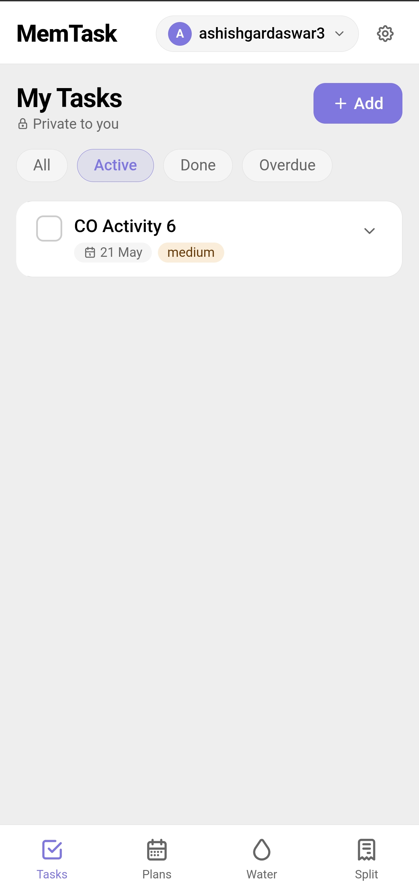
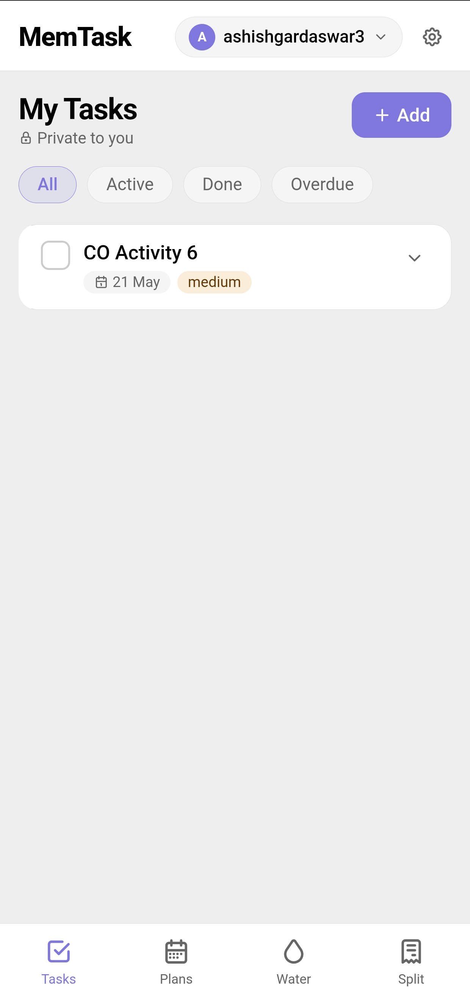
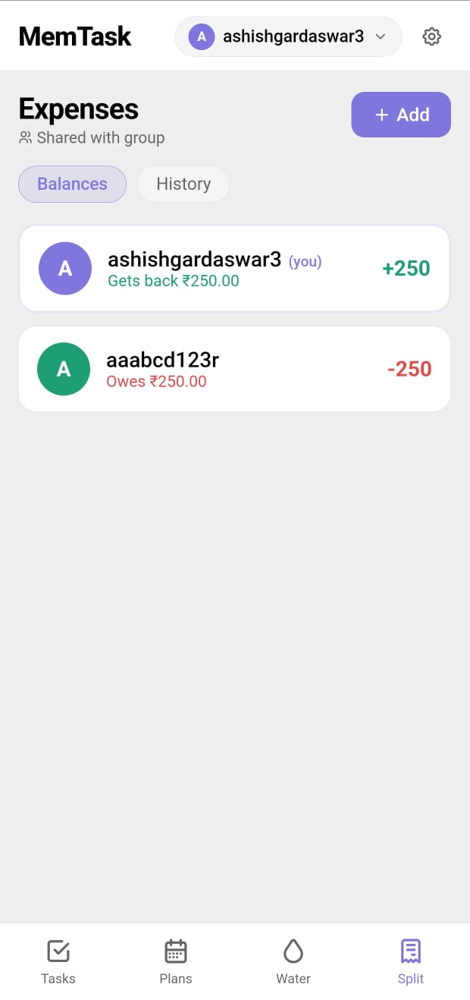
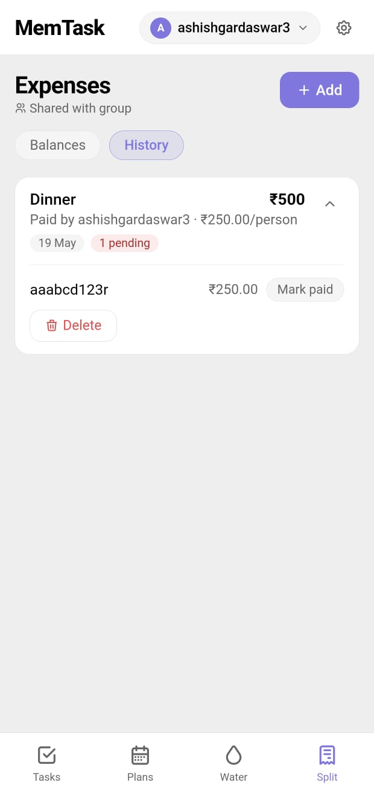
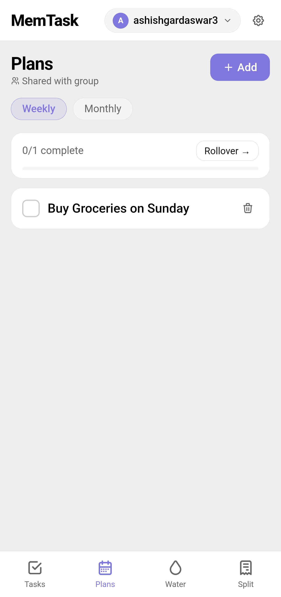
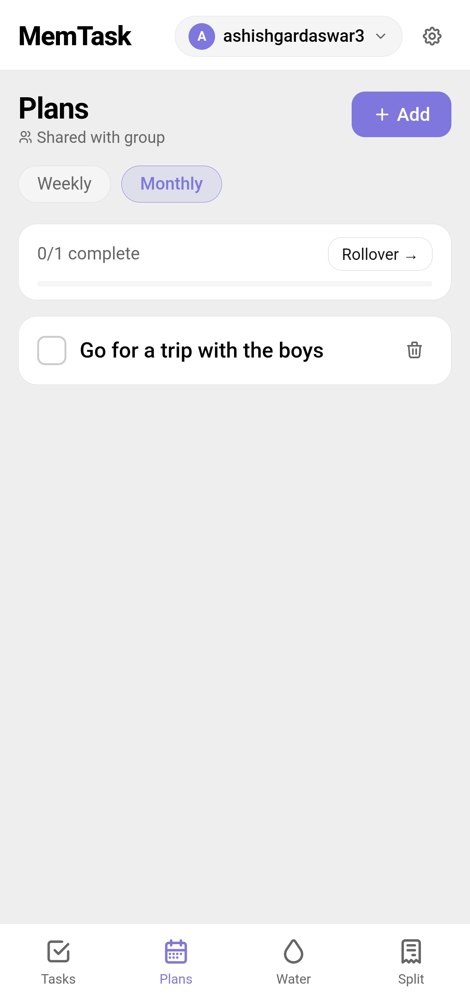
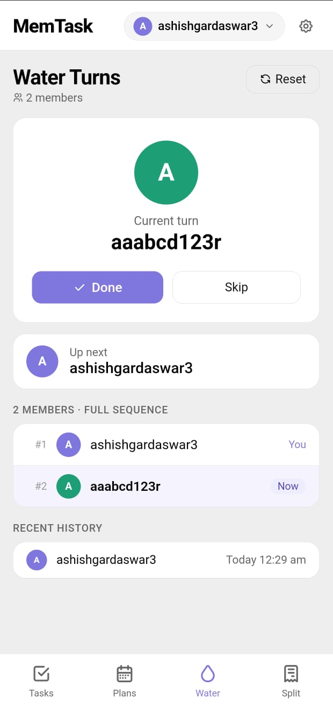
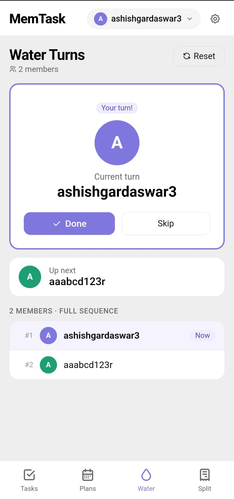

# MemTask

MemTask is a realtime collaborative productivity app built using React, Firebase, Firestore and Capacitor.

It helps groups manage:
- shared planning
- water turn rotation
- expense splitting
- collaborative productivity

The app supports realtime synchronization between members and works on both web and Android.

---

# Features

## Authentication
- Firebase Authentication
- Persistent login
- Secure group access

## Group Collaboration
- Create groups with invite codes
- Join existing groups
- Share/copy invite codes
- Group settings panel
- Leave group / logout support

## Tasks
- Personal private task management
- Task priorities
- Deadlines
- Overdue highlighting
- Task extensions
- Notes support

## Plans
- Shared weekly plans
- Shared monthly plans
- Completion tracking
- Rollover unfinished plans

## Water Turn System
- Shared water rotation tracker
- Turn history
- Skip support
- Reset support
- Current + next member indicators

## Expense Splitting
- Shared expenses
- Split between selected members
- Balance calculation
- Settlement tracking

## Android Support
- Built using Capacitor
- Android APK support
- Mobile-friendly UI

---

# Tech Stack

- React
- Firebase Authentication
- Firestore
- Capacitor
- Vite
- JavaScript

---

# Screenshots

## Tasks
(Add screenshot here)

## Plans
(Add screenshot here)

## Water Turns
(Add screenshot here)

## Expenses
(Add screenshot here)

## Group Settings
(Add screenshot here)

---

# Installation

## Clone Repository

```bash
git clone https://github.com/YOUR_USERNAME/memtask.git
```

## Install Dependencies

```bash
npm install
```

## Start Development Server

```bash
npm run dev
```

*.apk

---

# Firebase Setup

Create a Firebase project and enable:

- Firebase Authentication
- Cloud Firestore

Then create:

```js
firebase.js
```

with your Firebase configuration.

---

# Android Build

## Build Web App

```bash
npm run build
```

## Sync Capacitor

```bash
npx cap sync
```

## Open Android Studio

```bash
npx cap open android
```

Then:

```text
Build → Build APK(s)
```

---

# Screenshots

## Tasks




---

## Expenses




---

## Plans




---

## Water Turns





# Future Improvements

- Push notifications
- Dark mode
- QR invite system
- Group rename
- Task reminders
- Better analytics

---

# Project Status

Actively developed and continuously improved.

---

# Author

Ashish

GitHub:
https://github.com/ashish-gr12